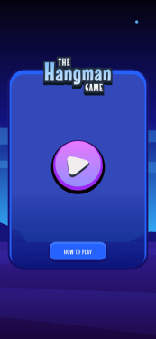

# Frontend Mentor - Hangman game solution

This is a solution to the [Hangman game challenge on Frontend Mentor](https://www.frontendmentor.io/challenges/hangman-game-rsQiSVLGWn). Frontend Mentor challenges help you improve your coding skills by building realistic projects.

## Table of contents

- [Overview](#overview)
  - [The challenge](#the-challenge)
  - [Screenshot](#screenshot)
  - [Links](#links)
- [My process](#my-process)
  - [Built with](#built-with)
  - [What I learned](#what-i-learned)
  - [Continued development](#continued-development)
  - [Useful resources](#useful-resources)
- [Author](#author)


## Overview

### The challenge

Users should be able to:

- Learn how to play Hangman from the main menu.
- Start a game and choose a category.
- Play Hangman with a random word selected from that category.
- See their current health decrease based on incorrect letter guesses.
- Win the game if they complete the whole word.
- Lose the game if they make eight wrong guesses.
- Pause the game and choose to continue, pick a new category, or quit.
- View the optimal layout for the interface depending on their device's screen size.
- See hover and focus states for all interactive elements on the page.
- Navigate the entire game only using their keyboard.

### Screenshot

 &nbsp; 


### Links

- Solution URL: [github repo](https://github.com/jay-ike/hangman-game)
- Live Site URL: [the PWA](https://ike-hangman-game.vercel.app/)

## My process

### Built with

- Semantic HTML5 markup
- CSS custom properties
- Flexbox
- CSS Grid
- Mobile-first workflow
- Service workers


### What I learned

I've learned so much throughout this project these are the most significant

In html I learn how to define the name of a section or any element you want to be announced by screenreaders

```html
<main aria-labelledby="main-title">
    <h1 id="main-title">Some HTML code I'm proud of</h1>
    <!-- other elements -->
</main>
```

In CSS I've learned how to animate popovers and how to use svg filters

```css
    .text-effect {
        filter: url(#svg-effect);
    }


    [popover] {
        &,
        &::backdrop {
            transition: display .35s allow-discrete,
                overlay .35s allow-discrete,
                transform 0.35s .35s ease-in,
                opacity .35s;
            opacity: 0;

        }

        &:popover-open,
        &:popover-open::backdrop {
            opacity: 1;
            transform: none;

            @starting-style {
                opacity: 0;
                transform: scale(2);
            }
        }
    }
```

In term of javascript I've learned how to register a service worker which is an ES6 module

```js
if (navigator.serviceWorker) {
    navigator.serviceWorker.register("/sw.js", {
        type: "module",
        updateViaCache: "imports"
    });
}
```

### Continued development

In a near future I may try to organise the questions by level to improve the user experience

### Useful resources

- [this video](https://www.youtube.com/watch?v=kfOhlU_iRVU) from [sara soueidan](https://www.sarasoueidan.com) helped me a lot to understand how to compose svg filters
- [this article](https://jakearchibald.com/2014/offline-cookbook) from jake archibald is maybe old but has helped me to understand how to manage offline status of my web app
- [this article](https://nerdy.dev/steal-this-popover-starter-kit) from adam argyle helped me to animate the dialog on the in game view


## Author

- Frontend Mentor - [@jay-ike](https://www.frontendmentor.io/profile/jay-ike)
- Mastodon - [@ndimah22](https://mastodon.social/@ndimah22)

